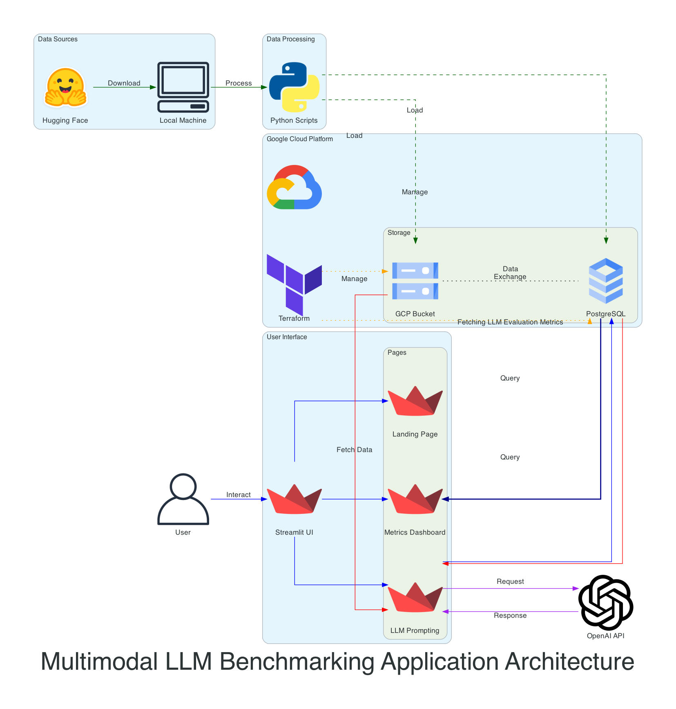

# GAIA Benchmark Validation Application


### Demo URL Link 

https://drive.google.com/drive/folders/1wgYeUY-HsDuWcqGq1hSNVRQ3gvQBMLZC?usp=sharing

### Deployed Streamlit app link

https://a1b1gaia.streamlit.app

### Code Labs Link

https://codelabs-preview.appspot.com/?file_id=1rkwEQLnM5Z62LN___AOHtexZJ9DzQ0kDlELlBA2dzlY#1


## Abstract
This project builds a validation tool for the GAIA dataset using a multi-page Streamlit interface. It allows users to randomly select and evaluate test cases, query different LLM models via the OpenAI API, and compare model responses with expected answers. Users can annotate incorrect responses and re-evaluate the model’s performance. A metrics dashboard displays the overall performance, and all interactions are tracked in a database for reporting and analytics.

## Checklist of Deliverables
- [x] Diagrams illustrating system architecture
- [x] Fully documented CodeLab
- [x] 5-minute video submission
- [x] Link to a working Streamlit application
- [x] GitHub repository with project files and documentation

## Architecture
The architecture consists of the following components:




1. **Data Sources**:
   - **Hugging Face**: Provides the GAIA dataset for validation and testing.
   - **GCP (Google Cloud Platform)**: Handles storage via GCS (Google Cloud Storage) buckets and stores metadata in a PostgreSQL database.

2. **Infrastructure**: 
   - **Terraform**: Automates the setup of GCP resources such as databases and buckets.

3. **Streamlit Application**: 
   - Multi-page UI with the following pages:
     - **Landing Page**: Documentation and introduction to the application.
     - **LLM Prompting Page**: Allows users to select a random task, submit a query to OpenAI models, and interact with responses.
     - **Metrics Dashboard**: Provides visualizations and reports on model performance.

4. **LLM Interaction**: 
   - **OpenAI API**: Queries are sent to OpenAI models for LLM responses, which are stored for comparison and further processing.

5. **Database**:
   - **PostgreSQL**: Stores task metadata, LLM responses, annotations, and interaction logs for analysis.

6. **Storage**: 
   - **GCS (Google Cloud Storage)**: Manages file uploads, including task-related files fetched during LLM processing.

## Tech Stack
- **Streamlit**: For the multi-page UI and interaction.
- **Hugging Face**: Source for GAIA dataset.
- **OpenAI API**: Used for querying different language models.
- **Google Cloud Platform** (GCS, PostgreSQL): Storage and database.
- **Terraform**: Infrastructure management.
- **Python**: For backend logic and integration with various APIs.

## Dataset
- **GAIA Dataset**: Available via Hugging Face, the GAIA dataset contains structured metadata and test cases. It forms the core of the benchmarking process.

## Data Storage

- Files and task-related data are stored in Google Cloud Storage (GCS) buckets.
- PostgreSQL on GCP is used for storing metadata, LLM responses, and user annotations.


## Features

### Landing Page:
- Basic documentation and overview of the application.

### LLM Prompting Page:
- Pick a random task from the GAIA dataset.
- Select from different LLM models (default to one OpenAI model).
- Fetch associated files from GCP and provide context for the query.
- Submit the question along with the context to OpenAI and view the LLM response.
- Annotate responses and re-submit the task for evaluation.
- Save responses to the database, either as-is or after annotation.

### Metrics Dashboard:
- Visualize performance metrics, including model accuracy, response quality, and interaction history.

## Project Installation Guide

### Prerequisites

Ensure that you have the following installed on your system:
- Python
- Terraform
- GIT
- GCP Account 


### 1. Clone the Repository

Now, clone the repository to your local machine:

```bash
git clone https://github.com/uk1601/LLM_Benchmarking_Application.git
cd LLM_Benchmarking_Application
```

### 2. Configure Secrets

To configure sensitive information like GCP credentials, OpenAI API key, and database settings:

Replace the placeholders (`xxxxxxx`) with your actual credentials in `secrets.toml`

### 3. Terraform Infrastructure Setup

If your project involves infrastructure management via Terraform, you can deploy the infrastructure as follows:

1. Initialize Terraform:

   ```bash
   terraform init
   ```

2. Plan the infrastructure changes:

   ```bash
   terraform plan
   ```

3. Apply the infrastructure changes:

   ```bash
   terraform apply
   ```

   Confirm the changes by typing `yes` when prompted.

  
### 4. Install Poetry

Poetry is used for dependency management. You can install it by running the following command:

```bash
curl -sSL https://install.python-poetry.org | python3 -
```

After installation, ensure that Poetry is added to your system's PATH by following the instructions provided after installation. To verify that Poetry is installed correctly, run:

```bash
poetry --version
```

### 5. Install Python Dependencies

With Poetry installed, you can now install all project dependencies:

```bash
poetry install
```

This command will set up a virtual environment and install all required packages as specified in `pyproject.toml`.

### 5. Activate the Poetry Shell

Activate the Poetry-managed virtual environment:

```bash
poetry shell
```

### 6. Go the the Application Directory

Change Directory to the folder containing Entrypoint
```bash
cd src 
```


### 7. Run the Streamlit App

To launch the application, execute the following command:

```bash
streamlit run GAIA.py
```

This will start the Streamlit app and open it in your browser.


### Conclusion

Your application should now be running, and the required infrastructure should be deployed. For additional configuration or updates, refer to the project-specific documentation.
